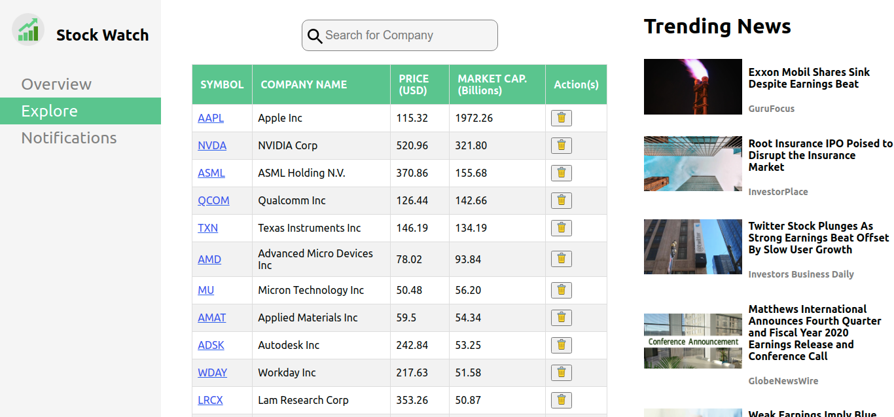
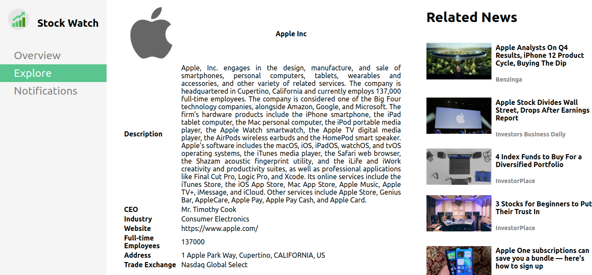

# Stock Watch App

> A web application built on React and Redux libraries to montior stocks and related stock information and news.

## Table of Contents

- [Features](#features)
- [Built With](#built-with)
- [Live Demo](#live-demo)
- [Getting Started](#getting-started)
  - [Installation](#installation)
  - [Usage](#usage)
- [Roadmap](#roadmap)
- [Author](#author)

## Features

- Allows user to monitor the stock prices.(Listed only few technology stocks, Feature for adding new stocks is in our roadmap.)
- User can search the list of stocks with live search feature.
- User can able to view the trending news of the market.
- Allows user can delete the selected stock.
- User can also view the company profile by clicking on the symbol.
- Allows user can read the selected stock related news headlines with its source mentioned as a link.

## Screenshot





## Built With

- React
- Redux
- React-Create-App
- npm
- CSS
- ES6
- Heroku
- [Financial Modeling Prep API](https://financialmodelingprep.com/developer/docs)

## Live Demo

[Live Demo Link](https://rna-stock-watch.herokuapp.com/)

## Getting Started

To get a local copy up and running, follow these simple example steps.

### Prerequisites

- NodeJs

<!-- ### Setup -->

### Installation

Clone the repo with:

```sh
git clone https://github.com/rna/stock-watch
```

### Usage

1. Run `npm install` to install all dependencies

2. Run `npm start` to start the local server

### Testing

1. Run `npm test a` to test

## Roadmap

- Addition of New stocks
- User Login and save their watchlist

<!-- ### Deployment -->

### Author

👤 **Ramesh Naidu Allu**

- Github: [@rna](https://github.com/rna)
- Twitter: [@rnadev](https://twitter.com/rnadev)
- Linkedin: [Linkedin](https://linkedin.com/in/ramesh-naidu)

## 🤝 Contributing

Contributions, issues and feature requests are welcome!

Feel free to check the [issues page](issues/).

## Show your support

Give a ⭐️ if you like this project!

## Acknowledgments

- [create-react-app-buildpack](https://github.com/mars/create-react-app-buildpack)
- [Financial Modeling Prep API](https://financialmodelingprep.com/developer/docs)

## 📝 License

This project is [MIT](lic.url) licensed.
